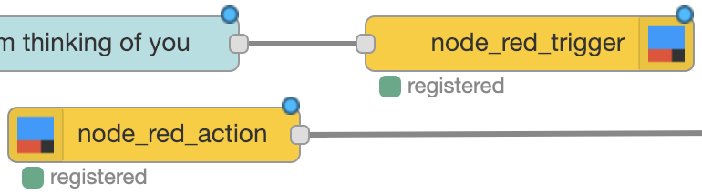

## Node-RED IFTTT Broker
An IFTTT Broker for Node-RED


 




## Why
This library allows you to send and receive **IFTTT** Triggers and Actions. 

**Note**: If you are only looking to initiate a Trigger check out Diego Pamio's [node-red-contrib-ifttt](https://flows.nodered.org/node/node-red-contrib-ifttt), it's much simplier and you'll have it set up and running in two seconds! 🌟

Still with us? 💁‍♀️

So you may be wondering what makes this library different? Well, building on top of Amadeus's excellent [node-ifttt](https://github.com/amadeusmuc/node-ifttt) we are able to provide full support of the IFTTT feature set. Most excellently we can make our own Node-RED flows triggered by IFTTT!

Additionally:

* support for a large volume of IFTTT Triggers
* multiple, custom IFTTT Action and Trigger Fields
* Triggers and Actions within multiple (user or custom) contexts *(not yet implemented)*

### Note: This library is super early in development and node structure and configuration information is subject to change!
We will do our best to change configuration only when necessary and do our best to use Node-RED's mechanisms to draw attention when things have changed.

## Install
Using this library requires an IFTTT account with access to the IFTTT Platform Service (free for private usage). To sign up visit here: [https://platform.ifttt.com/platform_sign_up](https://platform.ifttt.com/platform_sign_up)

To install the node run the following from your Node-RED user directory (`~/.node-red`):
```bash
npm install node-red-contrib-ifttt-broker
```

Or install the node from the Palette section of your Node-RED editor by searching by name (`node-red-contrib-ifttt-broker`).

**Watch this space for more elaborated instructions!**

## Contributions
There are many ways this library will be further built out but if you want a feature sooner feel free to create a pull request! Please first start a discussion in an issue so we can strategize implementation before you dive in, that way it'll be less work for you in the end!

## Thanks
This library stands on the shoulders of [Amadeus'](https://github.com/amadeusmuc) library [node-ifttt](https://github.com/amadeusmuc/node-ifttt), many thanks! 

Additionally the library was inspired by [node-red-contrib-mqtt-broker](https://github.com/zuhito/node-red-contrib-mqtt-broker), which is such a boon for locally routed MQTT communication!